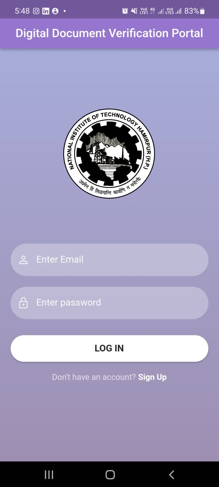

# *Digital Document Verification Portal*
It is an application to encrypt and decrypt data.

## *Core features*:

### Signup and Login:

### Dashboard:
Screen user lands on after successful login. 

#### Logout:
Logout button on dashboard to logout user of the existing account.

#### Encrypt:
Encrypts the entered data using aes encryption algorithm.

#### Dencrypt:
Decrypts the entered data using aes decryption algorithm.

### My Files:
Select and upload any file from your device to the firebase database. 

*The user can implement the full functionality of the app upon successful login.*

  
### *Installation Guide:*
- Install and setup android studio: https://developer.android.com/studio/install
- Clone the repository: `git clone https://github.com/vanshika-37/Digital-Document-Verification-Portal.git`
- Go to the project directory: `cd Digital-Document-Verification-Portal-master`
- Create a virtual environment and activate it:

 *For Windows:*
 Go to flutter console

   `> flutter doctor` 
   
   `> flutter pub get`

- The dependencies will be added successfully.
- Run `main.dart` either on a virtual device or connect a physical device using USB or Wi-Fi.
- Build APK: Build > Flutter > Build APK

## *Contributors:*
1. Divya Sahni
2. Samridhi Arora
3. Vanshika Sood
4. Bhanu Pratap

